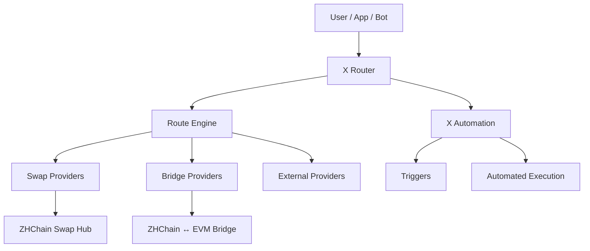

# X Router

**Cross-chain routing and automation layer for swaps, bridges and execution providers.**

X Router is an experimental infrastructure project focused on discovering, comparing and orchestrating execution routes across heterogeneous blockchain systems.

The project is designed around a provider-based architecture where swaps, bridges and external liquidity or execution sources can be connected through adapters instead of being hard-coded into a single system.

---

## 🚀 Goals

X Router aims to provide:

- unified route discovery
- provider abstraction
- bridge-aware routing
- swap-aware routing
- execution status classification
- automation triggers
- future conditional execution

---

## 🧭 Architecture



The Router does not implement every swap or bridge internally.

Instead, providers expose quotes, availability and execution capabilities through adapters, allowing the Route Engine to compare them using a common model.

---

## ⚙️ Current Status

**Stage:** Early MVP / active development

Current work includes:

- Route Engine v0.1
- provider adapter model
- ZHChain quote integration
- ZHC → WZHC bridge route integration
- partial-route classification
- executable / non-executable route detection
- cross-chain routing experiments

---

## 🔌 Provider Model

Each provider can expose information such as:

```json
{
  "provider": "example-provider",
  "from": "ASSET_A",
  "to": "ASSET_B",
  "amountIn": "1000",
  "amountOut": "975",
  "executable": true,
  "reason": null
}
```

The Route Engine can use this normalized representation to compare routes without depending on the internal implementation of each provider.

---

## 🧩 Planned Modules

### Route Engine

Discovers and compares available routes.

### Provider Adapters

Connect swaps, bridges and other execution sources.

### Quote Aggregation

Collects and normalizes quotes from multiple providers.

### Route Scoring

Evaluates routes using criteria such as:

- output amount
- execution availability
- liquidity
- limits
- fees
- route completeness

### X Automation

Planned automation layer for condition-based execution.

Example conditions may include:

- route becomes available
- price reaches a threshold
- liquidity becomes sufficient
- balance or blockchain event changes
- execution cost falls below a limit

---

## 🌐 Current Infrastructure

X Router is currently being developed alongside:

- **ZHChain Swap Hub**
- **ZHChain ↔ EVM Bridge**
- **ZHChain RPC infrastructure**
- **EVM test infrastructure**

These components remain independent providers and are not hard-coded into the Router core.

---

## 🛠 Tech Stack

`JavaScript` · `Node.js` · `JSON-RPC` · `REST APIs`  
`Solidity` · `EVM` · `Cloudflare Workers` · `PowerShell`

---

## 🗺 Roadmap

- [x] Route Engine prototype
- [x] provider adapter architecture
- [x] ZHChain quote source integration
- [x] bridge availability integration
- [ ] ZHChain Swap Hub adapter
- [ ] complete ZHC → USDT route discovery
- [ ] route scoring
- [ ] execution orchestration
- [ ] X Automation triggers
- [ ] additional blockchain providers
- [ ] public API
- [ ] developer documentation

---

## ⚠️ Development Status

X Router is currently experimental software.

Interfaces, routing logic and provider integrations may change as the architecture evolves.

Do not treat current route outputs as production-ready financial execution guarantees.

---

## 🤝 Collaboration

Open to:

- Web3 infrastructure collaborations
- grants
- accelerators
- cross-chain integrations
- provider integrations
- developer tooling partnerships

---

## 📌 Maintainer

**Alexey Chistyakov**  
Independent builder focused on cross-chain infrastructure, routing and automation.
