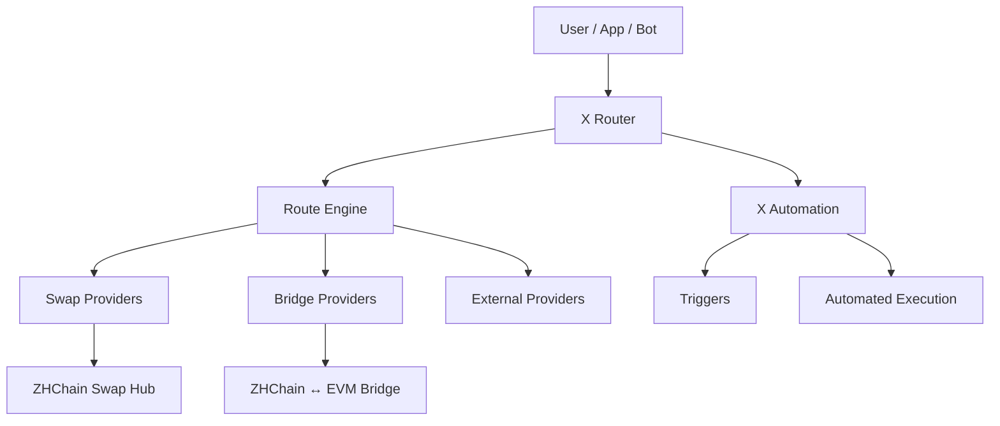
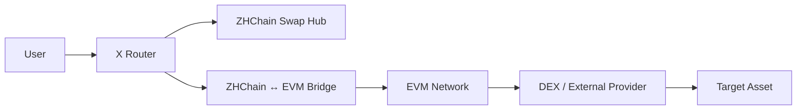

# X Router

**Cross-chain routing and automation layer for swaps, bridges and execution providers.**

X Router is an experimental infrastructure project focused on discovering, comparing and orchestrating execution routes across heterogeneous blockchain systems.

The project uses a provider-based architecture where swaps, bridges and external liquidity or execution sources can be connected through adapters instead of being hard-coded into a single system.

> 🗺️ **[View the live X Router Development Roadmap](https://github.com/users/lesha73/projects/1)**

---

## 🚀 Goals

X Router aims to provide:

- unified route discovery
- provider abstraction
- bridge-aware routing
- swap-aware routing
- execution status classification
- route scoring
- automation triggers
- conditional execution
- extensible cross-chain provider integration

---

## 🧭 Architecture



The Router does not implement every swap or bridge internally.

Instead, providers expose quotes, availability, limits and execution capabilities through adapters, allowing the Route Engine to compare heterogeneous infrastructure using a common model.

---

## ⚙️ Current Status

**Stage:** Early MVP / active development

Current development includes:

- Route Engine v0.1
- provider adapter architecture
- ZHChain quote integration
- ZHC → WZHC bridge integration
- partial vs complete route classification
- executable / non-executable route detection
- provider health classification
- Swap Hub integration
- cross-chain execution experiments

The current focus is moving from isolated infrastructure components toward complete end-to-end route discovery and execution orchestration.

---

## 🔌 Provider Model

Each provider exposes normalized routing information.

Example:

```json
{
  "provider": "example-provider",
  "from": "ASSET_A",
  "to": "ASSET_B",
  "amountIn": "1000",
  "amountOut": "975",
  "executable": true,
  "reason": null
}
```

Additional provider information may include:

- liquidity
- limits
- fees
- health status
- confirmation requirements
- route completeness
- execution availability
- rejection reason

The Route Engine can compare providers without depending on their internal implementation.

---

## 🧩 Core Components

### Route Engine

Discovers and compares available execution routes.

Responsibilities include:

- route discovery
- route normalization
- route completeness detection
- execution availability
- provider comparison
- future route scoring

### Provider Adapters

Connect external infrastructure to the Router.

Current and planned provider types include:

- swap providers
- bridge providers
- RPC sources
- liquidity providers
- DEX integrations
- external execution services

### Quote Aggregation

Collects and normalizes quotes from multiple providers.

A calculated quote is not automatically considered executable.

Execution availability is evaluated separately.

### Route Scoring

Planned scoring logic can evaluate routes using criteria such as:

- output amount
- execution availability
- liquidity
- transfer limits
- fees
- provider health
- route completeness
- execution cost

### X Automation

Planned condition-based automation layer built on top of routing infrastructure.

Example conditions:

- a route becomes available
- price reaches a threshold
- liquidity becomes sufficient
- provider health changes
- balance changes
- a blockchain event occurs
- execution cost falls below a configured limit

---

## 🔗 Infrastructure Providers

### [ZHChain Swap Hub](https://github.com/lesha73/zhchain-swap-hub)

On-chain swap and liquidity infrastructure for ZHChain.

It provides:

- quote generation
- liquidity-aware routing
- transaction preparation
- preflight validation
- provider-facing API capabilities

The Swap Hub remains an independent product and can operate without X Router.

---

### [ZHChain ↔ EVM Bridge](https://github.com/lesha73/zhchain-evm-bridge)

Cross-chain bridge infrastructure connecting ZHChain with EVM-compatible networks.

It provides:

- deposit sessions
- confirmation-aware processing
- forward bridge execution
- wrapped asset minting
- replay protection
- reverse processing
- bridge health and availability information

The bridge remains independent from the Router and is consumed through a provider adapter.

---

## 🧭 Example Route

A future complete route can combine multiple independent providers:



For a request such as:

```text
ZHC → USDT
```

the Router can compare alternative paths instead of assuming a single execution mechanism.

A bridge leg being available does **not** mean the complete `ZHC → USDT` route is executable.

---

## 🗺️ Development Roadmap

The live roadmap is maintained publicly in GitHub Projects:

### **[X Router — Development Roadmap →](https://github.com/users/lesha73/projects/1)**

Current roadmap snapshot:

### 🔴 Backlog

| Task | Area | Priority |
|---|---|---|
| Route scoring | Router | P0 |
| Complete ZHC → USDT route discovery | Router | P0 |
| X Automation triggers | Automation | P1 |
| Public API | Router | P1 |
| Developer documentation | Docs | P2 |
| Additional blockchain providers | Router | P2 |

### 🟠 In Progress

| Task | Area | Priority |
|---|---|---|
| ZHChain Swap Hub adapter | Swap | P0 |
| ZHChain ↔ EVM bridge adapter | Bridge | P0 |
| Execution orchestration | Router | P0 |

### ⚪ Testing

| Task | Area | Priority |
|---|---|---|
| Provider health classification | Router | P1 |
| Partial vs complete route detection | Router | P1 |
| Bridge availability checks | Bridge | P1 |

### 🟣 Done

| Task | Area | Priority |
|---|---|---|
| Route Engine prototype | Router | P0 |
| Provider adapter architecture | Router | P0 |
| ZHChain quote source integration | Swap | P0 |
| Bridge availability integration | Bridge | P0 |

The GitHub Project board is the source of truth for current development status. This README snapshot may lag behind active work.

---

## 🌐 Current Infrastructure

X Router is currently being developed alongside:

- **ZHChain Swap Hub**
- **ZHChain ↔ EVM Bridge**
- **ZHChain RPC infrastructure**
- **EVM test infrastructure**
- **Sepolia test environment**

These components remain independent providers and are not hard-coded into the Router core.

---

## 🛠 Tech Stack

`JavaScript` · `Node.js` · `JSON-RPC` · `REST APIs`  
`Solidity` · `EVM` · `Cloudflare Workers` · `D1` · `PowerShell`

---

## 🧠 Design Principles

### Provider independence

The Router should not depend on a single exchange, bridge or liquidity source.

### Honest executability

A quote is not the same as an executable route.

### Route completeness

Individual working route legs must not be presented as complete end-to-end routes.

### Health-aware routing

A running service is not automatically considered healthy.

Providers may report states such as:

```text
healthy
degraded
unavailable
```

### Modular expansion

New blockchains, bridges, swaps and execution providers should be connectable through adapters without redesigning the Router core.

---

## ⚠️ Development Status

X Router is currently experimental software.

Interfaces, routing logic, scoring models and provider integrations may change as the architecture evolves.

Current route outputs should not be treated as production-ready financial execution guarantees.

---

## 🤝 Collaboration

Open to:

- Web3 infrastructure collaborations
- cross-chain integrations
- routing provider integrations
- grants
- accelerators
- developer tooling partnerships
- blockchain infrastructure research

---

## 📌 Maintainer

**Alexey Chistyakov**

Independent builder focused on cross-chain infrastructure, routing and automation.

GitHub: [@lesha73](https://github.com/lesha73)
